# Event-Driven ETL Pipeline with AWS Serverless

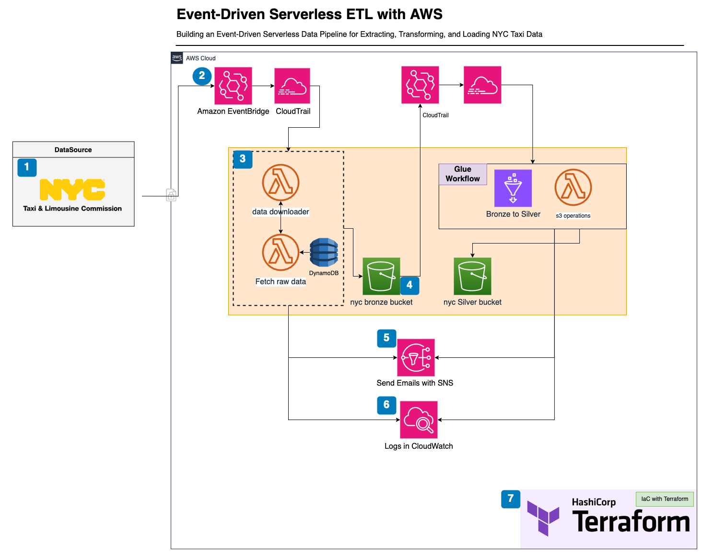


## ETL Process Overview

### Data Extraction

#### Data Source
The pipeline uses the NYC yellow cab trip dataset stored in Parquet format, updated with two months delay(usally).

`Data Website`: [Nyc Taxi Data](https://www.nyc.gov/site/tlc/about/tlc-trip-record-data.page)

#### Scheduling with Amazon EventBridge and CloudTrail:
Amazon EventBridge applies a schedule rule (`cron(0 11 * * ? *)`) to trigger the pipeline daily at 11 am(Because of irregularity in updates of nyc yellow taxi trip data). Lambda function handles if data is available and making sure no duplicate data is processed.

`nytaxi-monthly-trigger`: Amazon EventBridge Sechule rule
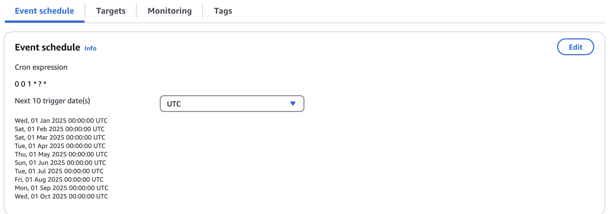


`data_downloader and fetch_raw_data`: Lambda functions to get url and download data
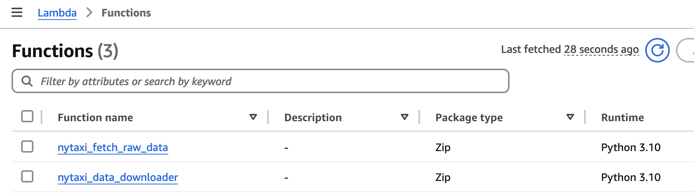

#### Fetch Data Lambda Function:
The `nyc_fetch_raw_data` lambda function fetches the dataset url from the data source url when the pipeline is triggered.

`nyc_fetch_raw_data`: Lambda functions to get url and download data from data source url.
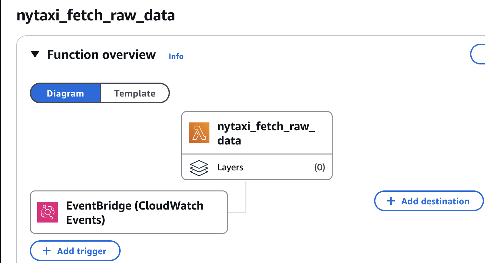

#### Data downloader Function:
The `nyc_data_downloader` downloads the dataset from the URL and uploads it to an bronze S3 bucket. A custom Python layer (requests package) is included for the download process.

`nyc_data_downloader`: Lambda functions downlaod from data source url
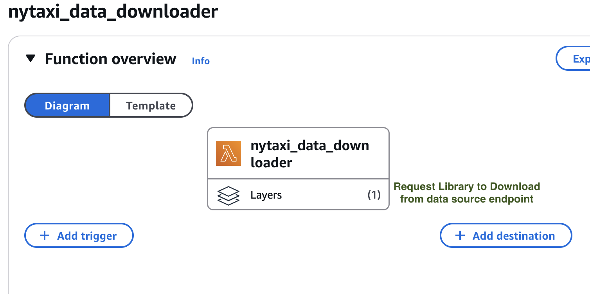
#### S3 Buckets:
- **Raw Data Bucket**: Stores the downloaded data.

    **Bronze Bucket Specification:**

            - Enables versioning for the S3 bucket.

            - Configures server-side encryption using the AES256 algorithm to encrypt objects stored in the bucket.

            - Blocks public access to the bucket by disabling public ACLs and policies.

            - Adds a lifecycle rule for the bucket to manage object transitions and expiration.

            - Moves objects to the `STANDARD_IA` (Infrequent Access) storage class after 30 days.

            - Deletes objects after 90 days.

`dataeng-dev-s3bronze-nyc-47893`: Bronze Bucket for raw data
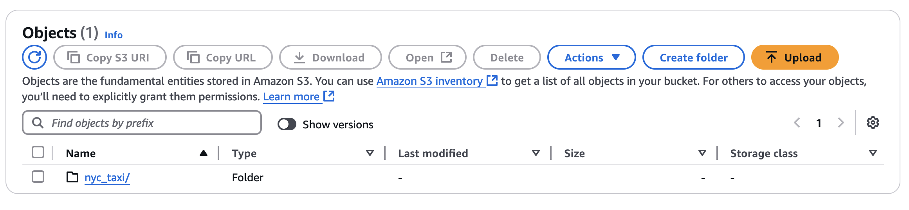

- **Code Bucket**: Stores Lambda function code, versioned for better management.
`dataeng-dev-s3bronze-nyc-lambda-code`: Lambda Code Bucket to store code.
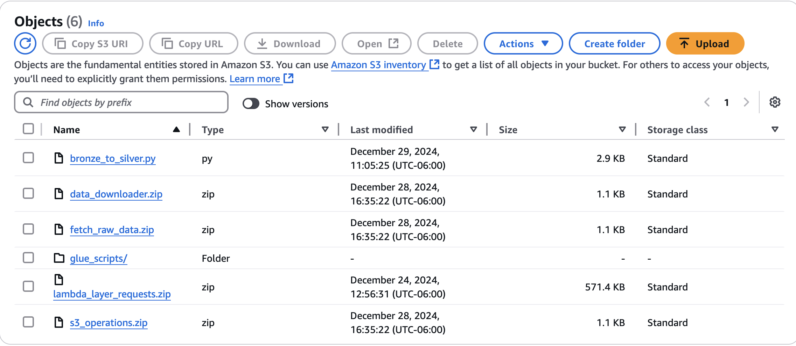

### Notifications:
Email notifications are sent to developers indicating whether the pipeline execution succeeded or failed.

### Logging:
Dedicated log groups are created for each Lambda function and Glue job. Logs help with debugging and error tracing.

`Log Groups`
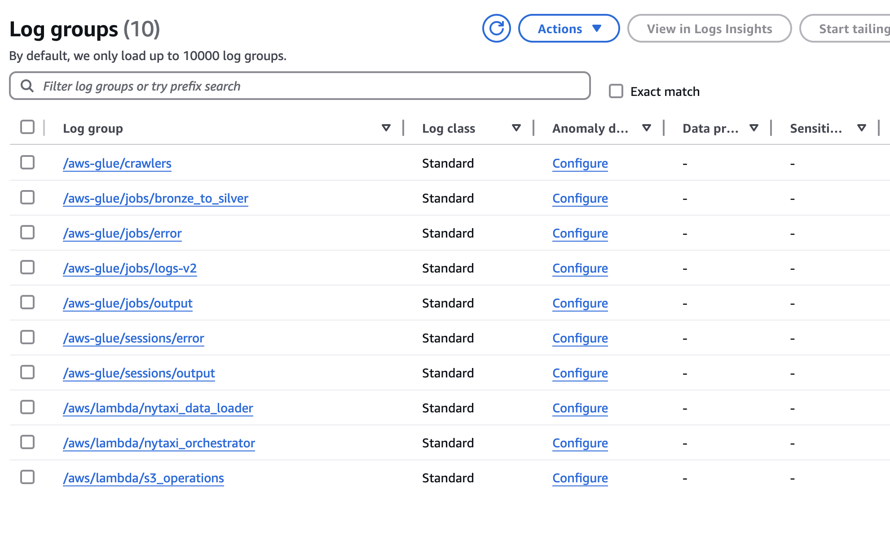

### Glue Job Trigger:
When a new file is detected in S3 (via CloudTrail and EventBridge rule), a Glue workflow is triggered to move the file from the Bronze to Silver layer. All events are logged.

```json
{
  "detail": {
    "eventName": ["PutObject", "CompleteMultipartUpload"],
    "eventSource": ["s3.amazonaws.com"],
    "requestParameters": {
      "bucketName": ["dataeng-dev-s3bronze-nyc"],
      "key": [{
        "prefix": "nyc_taxi/"
      }]
    }
  },
  "detail-type": ["AWS API Call via CloudTrail"],
  "source": ["aws.s3"]
}
```

`Glue Workflow`
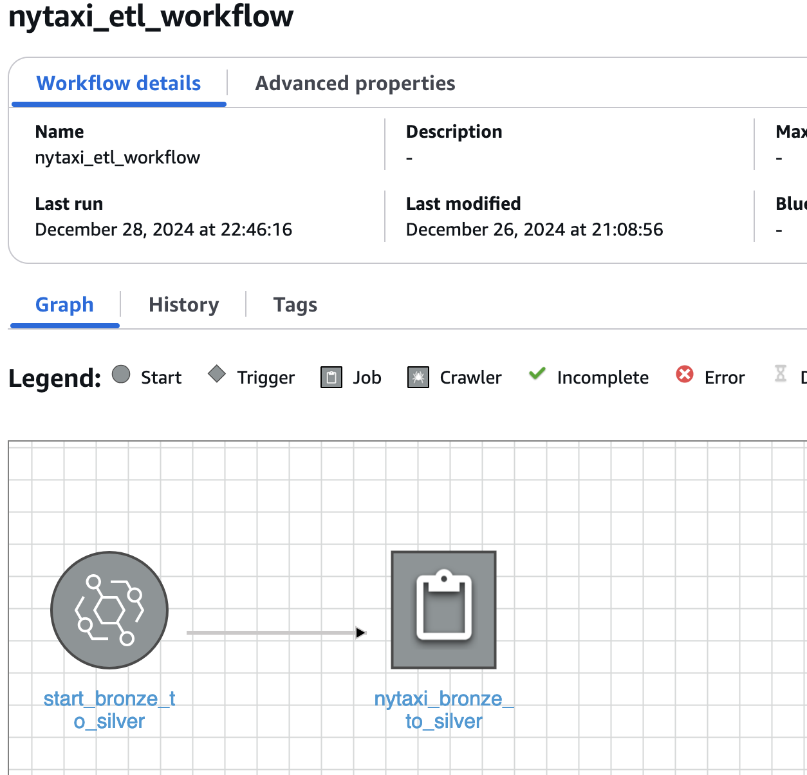


`Trigger`
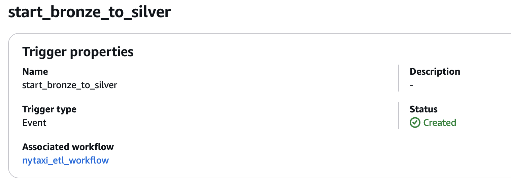

`Glue Spark Job`
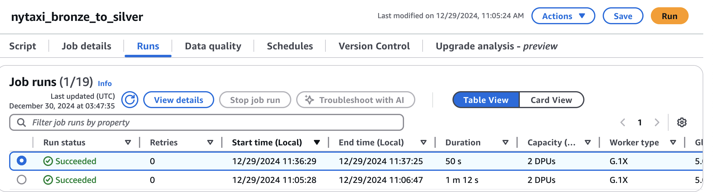
### Infrastructure as Code:
All AWS resources (Lambda, S3, EventBridge, Glue) are managed and maintained using **Terraform** (Infrastructure as Code).

---

The ETL pipeline automates data processing with minimal manual intervention, ensuring regular updates and accurate data management.
